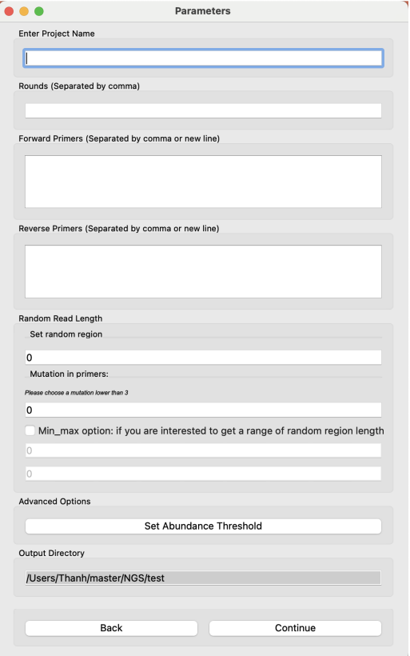
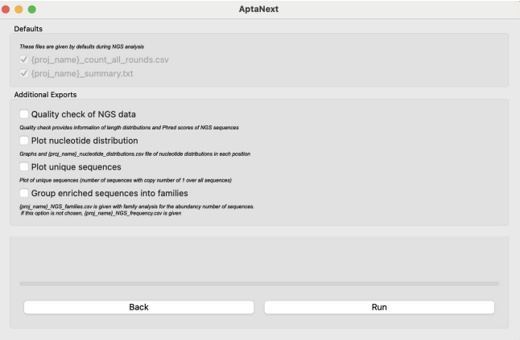
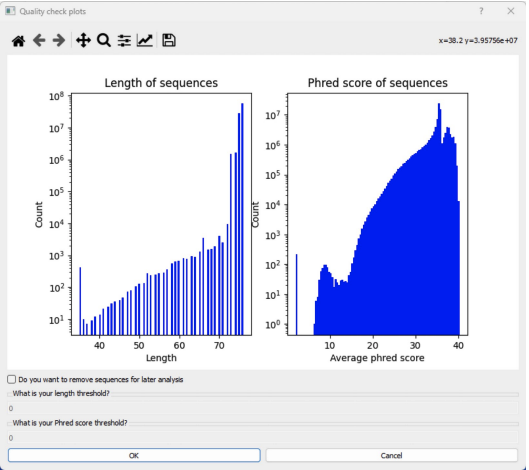

# NGS ANALYSIS FOR APTAMER
Content:
- [NGS ANALYSIS FOR APTAMER](#ngs-analysis-for-aptamer)
  - [1. Goal:](#1-goal)
  - [2. Tools:](#2-tools)
  - [3. Structures:](#3-structures)
   
## 1. Goal: 
The software was designed to load and preprocess NGS reads of aptamers at different rounds. It could be compiled by cx_freeze and was accompanied with GUI for easy use. 

## 2. Tools: 
The software provides the following tools.
1. Quality check of NGS reads: not all reads are selected for preprocessing. Reads with low Phred scores are excluded
2. Trimming sequences
3. Clustering sequences for family groups of sequences based on small mutation
4. Statistics of nucleotide distribution

## 3. Structures:
1. [AptaNext2.1.py](AptaNext2.1.py): the main file to run and connect all modules together
2. [tools](tools): NGS tools for all the listed NGS preprocesing
3. [GUI](GUI): GUI design for the software
4. [control_panel](control_panel): links tooks and GUI together
5. [setup.py](setup.py): script to compile the software in Python
   
Some examples of GUI:

Figure 1: Options for analysis

Figure 2: Options for analysis

Figure3: Plots for quality check

